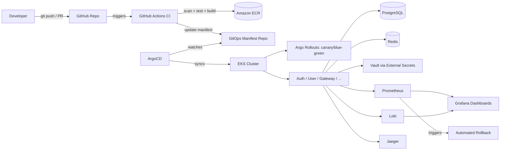
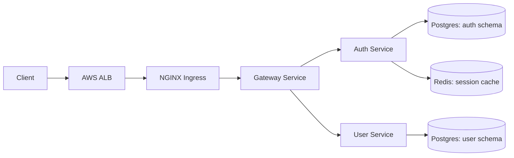
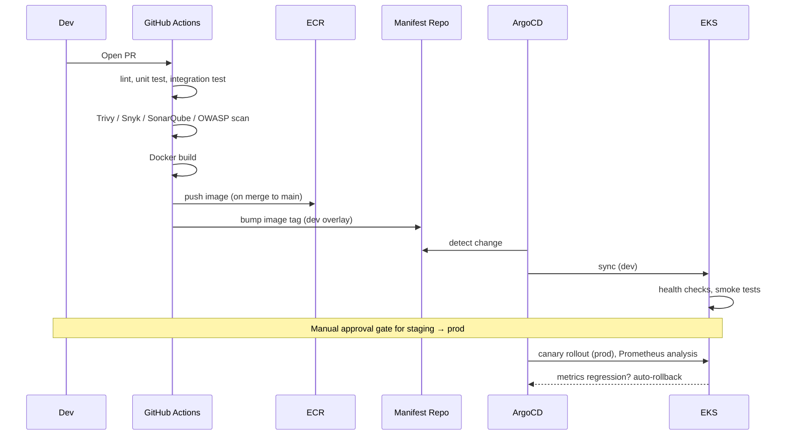

# M0 — Platform Architecture Documentation

**Project:** Enterprise CI/CD Platform
**Milestone:** M0 (Documentation-only, no code)
**Status:** Draft for review
**Owner:** Platform Engineering

---

## 1. Executive Summary

This document defines the target architecture, design rationale, phased scope, and
delivery plan for an enterprise-grade CI/CD platform. It is the gating artifact for
M0: no implementation work begins until this document is reviewed and accepted.

The platform's job is to take a code change from pull request to production, on
Kubernetes, with automated testing, security scanning, progressive delivery,
observability, and rollback — safely enough that a small platform team can operate
it for a service population serving hundreds of thousands of users.

This is phased. M0–M2 target a **single reference service** (Auth Service) taken
all the way through the pipeline for real, so the pattern is proven before it is
replicated across the remaining eight services. Building nine services shallowly
produces nine things that don't really work; building one deeply produces a
template that scales.

---

## 2. Scope and Non-Goals

### In scope for the platform (full roadmap)
- 3 core services first (Auth, User, Gateway), then Notification, Email, Audit,
  Analytics, Frontend, Admin Dashboard
- GitHub Actions CI; ArgoCD-driven GitOps CD
- EKS on AWS, provisioned via Terraform
- Prometheus/Grafana/Loki/Jaeger observability
- Vault-backed secrets via External Secrets Operator
- Progressive delivery (canary/blue-green) via Argo Rollouts
- Security scanning (Trivy, Snyk, SonarQube, OWASP Dependency-Check), SBOM
- Chaos/failure testing

### Explicitly out of scope for now (deferred, not abandoned)
- **Jenkins as a parallel primary CI system.** Running two CI systems for the same
  pipelines duplicates maintenance for no benefit. Jenkins is deferred until there's
  a concrete reason for it (e.g., an on-prem runner requirement) — at which point
  it gets a scoped responsibility, not a duplicate pipeline.
- **All 9 services in parallel.** Deferred to M9, after the pattern is proven.
- **Multi-region / DR failover automation.** Documented as a strategy in M0 docs,
  implemented after the single-region path is solid.
- **WAF, Route53, multi-account IAM boundaries.** Real but not gating for a
  first working slice; scheduled into the Terraform milestone plan below.

### Non-goals
- This is not a tutorial or toy project. Every component that ships is meant to run.
- This is not a "cover every tool in the tech stack at once" exercise — tools are
  introduced in the milestone where they earn their place.

---

## 3. Architecture Overview

### 3.1 System Context



**Key property:** CI never talks to the cluster directly. CI's responsibility ends
at "image built, scanned, pushed; manifest repo updated." ArgoCD reconciles cluster
state from Git. This is what makes rollback a `git revert`, gives an audit trail
for free, and lets us detect drift — a CI system that pushes directly to the
cluster can't honestly give us any of those three.

### 3.2 Request Path (runtime)



### 3.3 Environments

Three environments, same manifests, different overlays (Kustomize) and different
Terraform workspaces: `dev`, `staging`, `prod`. Promotion between them is a
manifest-repo change (image tag bump), reviewed the same way code is reviewed.

---

## 4. Design Decisions (ADR-style)

| # | Decision | Rationale | Alternative considered | Why rejected |
|---|---|---|---|---|
| ADR-1 | Monorepo for services + apps | Shared contracts (auth tokens, event schemas) change atomically across producer/consumer; single CI config surface | Polyrepo per service | Version-skew coordination overhead outweighs benefit at this team size |
| ADR-2 | GitOps (ArgoCD) over CI-push deploys | Git-native rollback, audit trail, drift detection | GitHub Actions `kubectl apply` | Push-based deploys have no reconciliation loop — cluster can silently drift from what CI thinks it deployed |
| ADR-3 | Argo Rollouts for canary/blue-green | Automated analysis against Prometheus metrics is a solved problem here | Hand-rolled bash canary scripts | Reimplementing progressive delivery logic is exactly the "fake implementation" risk this project must avoid |
| ADR-4 | Database-per-service (separate schema/instance) | Enforces service boundaries from day one | Shared Postgres database across services | Shared DB is the most common cause of "distributed monolith" — services become coupled through the schema |
| ADR-5 | Vault + External Secrets Operator | Standard, auditable K8s↔Vault integration pattern | Manually synced K8s Secrets | Manual sync has no rotation story and no audit trail |
| ADR-6 | Reference-service-first delivery order | Prove the full pipeline (build→scan→deploy→observe→rollback) on one service before replicating | Build all 9 services in parallel | Parallel shallow build produces 9 things that don't fully work; sequential deep build produces a proven, replicable template |
| ADR-7 | Jenkins deferred, not included in v1 | Two CI systems for identical pipelines is duplicated maintenance | Run GitHub Actions + Jenkins in parallel from day one | No concrete requirement yet justifies the duplication; revisit if one appears (e.g. on-prem runners) |

---

## 5. Repository Structure

```
enterprise-cicd-platform/
├── apps/
│   ├── frontend/                  # React + TS + Tailwind
│   └── admin-dashboard/
├── services/
│   ├── auth-service/               # Go — M2
│   ├── user-service/                # Go — M6
│   ├── gateway/                      # Go — M6
│   ├── notification-service/          # Python/FastAPI — M9
│   ├── email-service/                  # Python/FastAPI — M9
│   ├── audit-service/                   # Go — M9
│   └── analytics-service/                # Python/FastAPI — M9
├── infrastructure/terraform/
│   ├── modules/{vpc,eks,ecr,iam,rds}/
│   └── environments/{dev,staging,prod}/
├── helm/{charts,umbrella}/
├── kubernetes/{base,overlays}/{dev,staging,prod}/
├── .github/workflows/
├── monitoring/{prometheus,grafana,loki,jaeger}/
├── security/{vault,policies,trivy-configs}/
├── scripts/
├── docs/
│   ├── architecture/           ← this document lives here
│   ├── runbook.md
│   ├── disaster-recovery.md
│   └── incident-response.md
└── manifests-repo/              # separate repo in practice; ArgoCD source of truth
```

---

## 6. CI/CD Flow



---

## 7. Milestone Roadmap and Definition of Done

Every milestone below follows the same gate: **doc first, review, then code.**

| Milestone | Deliverable | Documentation required before code |
|---|---|---|
| M0 | This document | N/A — this is it |
| M1 | Terraform: VPC + EKS + ECR (dev) | Design doc: module boundaries, state backend, variable strategy, blast-radius analysis, risks, test plan (terraform plan/validate, tflint, checkov), acceptance criteria |
| M2 | Auth Service (Go, Clean Architecture) | Design doc: layer boundaries, API contract, data model, error handling strategy, test plan (unit/integration/contract), acceptance criteria |
| M3 | CI pipeline for Auth Service | Design doc: pipeline stages, failure modes, secrets handling in CI, caching strategy, acceptance criteria |
| M4 | Helm + ArgoCD app for Auth Service | Design doc: chart values strategy, sync policy, health checks, rollback triggers, acceptance criteria |
| M5 | Observability for Auth Service | Design doc: SLIs/SLOs, dashboard spec, alert thresholds, acceptance criteria |
| M6 | User Service + Gateway | Reuse M2–M5 doc templates, delta-only docs |
| M7 | Canary + automated rollback | Design doc: analysis metrics, rollback triggers, blast radius, acceptance criteria |
| M8 | Vault + External Secrets | Design doc: trust boundary, rotation policy, failure mode if Vault is unreachable |
| M9 | Remaining 6 services | Delta docs per service |
| M10 | Chaos experiments + runbooks | Design doc: experiment catalog, blast radius, abort criteria |

---

## 8. Risks and Mitigations

| Risk | Impact | Likelihood | Mitigation |
|---|---|---|---|
| Scope creep re-expands to "all 9 services at once" | Shallow, non-functional result | High if not actively managed | Hold the line on reference-service-first ordering (ADR-6); revisit only after M5 |
| GitOps manifest repo becomes a bottleneck/single point of coordination | Deploy delays | Medium | Automate tag bumps via CI bot commit, not manual PRs, once M3 lands |
| Vault unavailability blocks pod startup | Service outage | Medium | External Secrets caching + documented Vault HA plan (M8 doc) |
| Canary analysis false-positives block legitimate deploys | Deploy friction | Medium | Tune analysis thresholds during M7 with real traffic data, not guessed defaults |
| Two CI systems reintroduced later without a clear split | Duplicated maintenance | Low (deferred by ADR-7) | Any future Jenkins addition requires its own ADR justifying the specific responsibility split |
| Documentation-first process slows perceived velocity | Stakeholder impatience | Medium | This doc + roadmap makes the trade-off explicit up front |

---

## 9. Testing Strategy (platform-level)

- **Infrastructure:** `terraform validate`, `terraform plan` diff review, `tflint`, `checkov` policy scan — defined fully in M1 doc.
- **Services:** unit tests (table-driven in Go, pytest in Python), integration tests against real Postgres/Redis via testcontainers, contract tests at the Gateway boundary — defined fully in M2 doc.
- **Pipeline:** every CI stage has a defined failure mode (fail closed) and is tested against a deliberately broken PR before being trusted — defined in M3 doc.
- **Deployment:** smoke tests + automated health checks gate every environment promotion; canary analysis gates production — defined in M4/M7 docs.
- **Chaos:** pod/node/network failure injection against a running canary to validate that rollback actually triggers — defined in M10 doc.

---

## 10. Acceptance Criteria for M0

This milestone is complete when:
- [ ] Architecture diagrams (system context, request path, CI/CD flow) are reviewed and accepted
- [ ] All ADRs in Section 4 are agreed, including the deferrals (Jenkins, parallel services, multi-region)
- [ ] Repository structure is accepted as the working layout
- [ ] Milestone roadmap and its doc-first gating process are agreed
- [ ] Risks in Section 8 are acknowledged
- [ ] A decision is made on which milestone (M1 or M2) to document next

No code, Terraform, Helm charts, or CI workflows are written until this checklist is signed off.

---

## 11. Open Decision

Next up is the design document for **either M1 (Terraform foundation) or M2 (Auth Service)** — whichever is chosen becomes the next artifact, still documentation-only, followed by its own acceptance checklist before any implementation begins.
