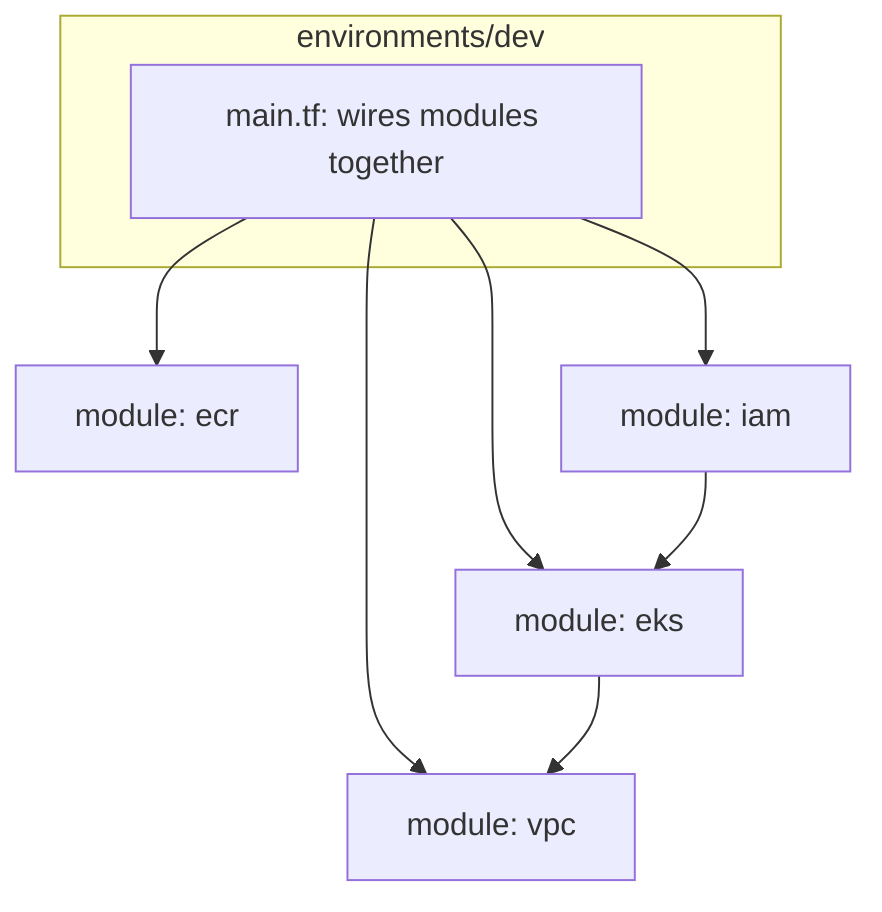

# M1 — Terraform Foundation Design Document

**Project:** Enterprise CI/CD Platform
**Milestone:** M1 (Documentation-only, no code)
**Depends on:** M0 (signed off)
**Status:** Draft for review

---

## 1. Objective

Provision the minimum real AWS foundation needed to run one service (Auth Service,
M2) on EKS in the `dev` environment: VPC, subnets, NAT/IGW, EKS cluster, ECR
repository, and the IAM roles that tie them together. Staging and prod follow the
same modules with different variable inputs — not different code.

This milestone does **not** provision RDS, Vault, Route53, or WAF. Those are
introduced in the milestones that first need them (M2 needs a database, so RDS
module design lands in the M2 doc's infra appendix; M8 needs Vault; WAF/Route53
are deferred per M0 §2). Provisioning them now, unused, would violate the
reference-service-first ordering agreed in ADR-6.

---

## 2. Module Boundaries

| Module | Responsibility | Inputs | Outputs |
|---|---|---|---|
| `modules/vpc` | VPC, public/private subnets across 2 AZs, IGW, NAT Gateway(s), route tables | `cidr_block`, `az_count`, `environment` | `vpc_id`, `private_subnet_ids`, `public_subnet_ids` |
| `modules/eks` | EKS control plane, managed node group, cluster autoscaler IAM/tags | `vpc_id`, `subnet_ids`, `cluster_name`, `node_instance_types` | `cluster_endpoint`, `cluster_name`, `oidc_provider_arn` |
| `modules/ecr` | ECR repo per service, lifecycle policy (expire untagged images), scan-on-push | `repository_names` (list) | `repository_urls` (map) |
| `modules/iam` | IRSA roles for in-cluster service accounts (starting with cluster-autoscaler, external-dns placeholder for later) | `oidc_provider_arn`, `cluster_name` | role ARNs |

**Rationale for this split (ties to ADR-1, monorepo):** each module is independently
testable and independently reusable across `dev`/`staging`/`prod` workspaces without
duplicating HCL. `environments/<env>/main.tf` only wires modules together with
environment-specific variables — it contains no resource logic itself.

---

## 3. State Backend Strategy

- **Backend:** S3 + DynamoDB lock table, one state file per environment
  (`envs/dev/terraform.tfstate`, etc.), not one shared state for all three.
- **Rationale:** a single shared state means a `staging` plan can show a diff that
  accidentally touches `prod` resources if variables are wired wrong. Per-environment
  state makes the blast radius of any one `terraform apply` bounded to that
  environment by construction, not by discipline.
- **Bucket:** versioning enabled, SSE-KMS encryption, bucket policy restricting
  write access to the CI role only — no local `terraform apply` from a laptop
  against shared environments.
- **Lock table:** DynamoDB, on-demand billing (low, predictable cost for a lock table).

---

## 4. Variable Strategy

- `environments/dev/terraform.tfvars`, `environments/staging/...`, `environments/prod/...`
  — explicit files per environment, not a single file with conditionals. Conditionals
  in shared tfvars are how a `dev`-only change accidentally ships to `prod`.
- Naming convention: every resource tagged `Environment`, `ManagedBy=terraform`,
  `Project=enterprise-cicd-platform` for cost allocation and blast-radius tracing
  in CloudWatch/Cost Explorer later.
- Sizing differences are the *only* thing that varies between environments at this
  milestone (node instance types, NAT Gateway count — single NAT in dev to control
  cost, one NAT per AZ in prod for HA). Module logic itself does not branch on
  environment name.

---

## 5. Blast-Radius Analysis

| Change type | Blast radius | Guardrail |
|---|---|---|
| `terraform apply` in `dev` | dev VPC/EKS/ECR only (separate state) | CI runs `plan`, requires human review of the diff before `apply` |
| `terraform apply` in `staging`/`prod` | that environment only | Same as dev, plus manual approval gate (ties to M0 CI/CD flow) |
| VPC CIDR change post-creation | Full environment rebuild (VPC CIDR is immutable in-place) | CIDR chosen up front with room for subnet growth: `/16` per environment, not `/24` |
| EKS node group instance type change | Rolling node replacement, brief capacity dip | PodDisruptionBudgets (introduced at service level in M2/M6) prevent full outage during roll |
| Deleting the ECR module from state | Would delete image repos (and images) | `prevent_destroy = true` lifecycle on ECR repo resources; explicit two-step removal process documented in runbook |

---

## 6. Security Considerations

- EKS API endpoint: private + restricted public access (CI runner IP range and
  break-glass admin IPs only) — not fully public.
- Node groups run in private subnets only; NAT Gateway provides egress, nothing
  inbound from the internet directly to nodes.
- IRSA (IAM Roles for Service Accounts) used from the start so pods get scoped
  IAM permissions via OIDC federation — not node-level IAM roles shared by every
  pod on a node.
- ECR: scan-on-push enabled at the Terraform level (baseline scanning), with the
  deeper Trivy/Snyk pipeline scanning layered on top in M3 — these are
  complementary, not redundant: ECR scan-on-push catches known CVEs in the stored
  image at rest; pipeline scanning gates the PR before merge.

---

## 7. Risks and Mitigations

| Risk | Impact | Mitigation |
|---|---|---|
| Manual `apply` from a developer laptop drifts state | Untracked changes, state corruption | S3 bucket policy restricts write to CI role; documented in runbook that all applies go through CI |
| NAT Gateway cost surprise at scale | Budget overrun | Single NAT in dev (accepted single point of failure for non-prod); cost tagged and tracked from day one |
| EKS version drift across environments | "Works in dev, breaks in prod" | Same module version pinned across environments; only tfvars differ |
| State file loss | Full environment state unknown, risk of orphaned resources | S3 versioning + DynamoDB lock; documented state recovery procedure in runbook (M1 code milestone will include `terraform import` playbook) |

---

## 8. Test Plan

- `terraform fmt -check` and `terraform validate` on every PR touching `infrastructure/terraform/`.
- `tflint` for provider-specific best-practice linting.
- `checkov` (or `tfsec`) for security policy scanning of the HCL itself — catches
  things like unencrypted S3 buckets or overly permissive security groups before
  apply.
- `terraform plan` output posted as a PR comment for human review — no apply
  without a visible, reviewed diff.
- Post-apply smoke test (scripted, run in CI): confirm `aws eks describe-cluster`
  returns `ACTIVE`, confirm `kubectl get nodes` shows expected node count, confirm
  ECR repo is reachable and scan-on-push is enabled.
- No destructive testing against `staging`/`prod` state — `dev` is the only
  environment where a full destroy/recreate cycle is exercised.

---

## 9. Acceptance Criteria for M1

This milestone's **documentation** is complete when:
- [ ] Module boundaries (Section 2) are agreed — no resource logic outside the four modules
- [ ] State backend strategy (per-environment S3+DynamoDB, CI-only write access) is agreed
- [ ] Variable strategy (explicit per-environment tfvars, no conditionals) is agreed
- [ ] Blast-radius table (Section 5) is reviewed, especially the CIDR sizing decision and ECR `prevent_destroy`
- [ ] Security considerations (private EKS endpoint, IRSA from day one) are agreed
- [ ] Test plan (Section 8) is accepted as the CI gate for all future Terraform PRs

Only once this is signed off does actual `.tf` code get written for `modules/vpc`,
`modules/eks`, `modules/ecr`, `modules/iam`, and `environments/dev`.

---

## 10. Open Decision

After sign-off, implementation of M1 proceeds module by module
(`vpc` → `iam` → `eks` → `ecr`, in that dependency order), or we move to the
**M2 (Auth Service) design doc** first and come back to M1 code once both
foundational docs are approved together. Your call.
