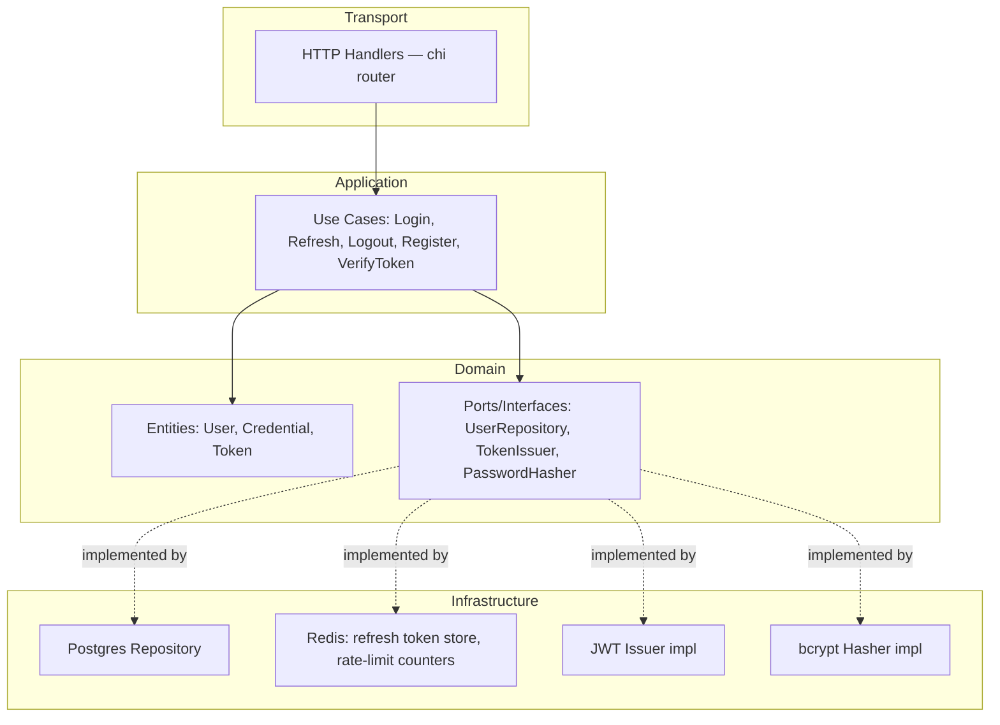

# M2 — Auth Service Design Document

**Project:** Enterprise CI/CD Platform
**Milestone:** M2 (Documentation-only, no code)
**Depends on:** M0, M1 (both signed off)
**Status:** Draft for review

---

## 1. Objective

Design the reference service that proves the entire pipeline end to end: build,
test, scan, deploy, observe, roll back. Auth Service is chosen as the reference
(over User Service or Gateway) because it has the richest failure surface worth
proving early — password hashing, token issuance, token revocation, rate limiting
on login — and every other service in the platform depends on it working correctly.

Scope for M2 is the service itself: its internal architecture, API contract, data
model, and error handling. Its Dockerfile, CI pipeline, Helm chart, and dashboards
are separate milestones (M3–M5) — this doc does not reach into those.

---

## 2. Responsibilities and Non-Responsibilities

**Auth Service owns:**
- User credential storage (hashed, never plaintext) and verification
- Access token issuance (JWT, short-lived) and refresh token issuance (opaque, longer-lived, revocable)
- Token revocation / logout
- Login rate limiting (brute-force protection)

**Auth Service does NOT own:**
- User profile data (name, email preferences, etc.) — that's User Service; Auth
  Service stores only what's needed to authenticate (credential hash, user ID,
  account status)
- Authorization/permission logic beyond "is this token valid" — coarse-grained
  authz decisions belong at the Gateway; fine-grained resource authz belongs to
  the owning service
- Sending emails (password reset emails are triggered by Auth Service but sent by
  Email Service via an event, not a direct SMTP call from Auth Service)

This boundary matters because conflating "authentication" with "user profile" is
the most common cause of Auth Service becoming a bottleneck every other team has
to route around.

---

## 3. Internal Architecture — Clean Architecture Layering



**Dependency rule:** dependencies point inward only. `Domain` defines interfaces
(`UserRepository`, `TokenIssuer`, `PasswordHasher`); `Infrastructure` implements
them. `Application` (use cases) depends on the `Domain` interfaces, never on
concrete Postgres/Redis/JWT types directly. This is what makes the use-case layer
unit-testable with fakes, with no database or network involved — that testability
is the entire point of the layering, not a formality.

**Package layout (Go, standard project layout):**
```
services/auth-service/
├── cmd/server/main.go              # composition root: wires infra impls into use cases
├── internal/
│   ├── domain/                     # entities + port interfaces, zero external deps
│   ├── usecase/                    # Login, Register, Refresh, Logout, VerifyToken
│   ├── transport/http/             # handlers, request/response DTOs, middleware
│   └── infrastructure/
│       ├── postgres/               # UserRepository impl
│       ├── redis/                  # refresh token store, rate limiter
│       ├── jwt/                    # TokenIssuer impl
│       └── bcrypt/                 # PasswordHasher impl
└── migrations/                     # SQL migrations (golang-migrate)
```

---

## 4. API Contract (v1)

| Method | Path | Purpose | Auth required |
|---|---|---|---|
| POST | `/v1/auth/register` | Create account (credential only; profile creation is a separate call to User Service triggered by an event) | No |
| POST | `/v1/auth/login` | Verify credentials, issue access + refresh token | No |
| POST | `/v1/auth/refresh` | Exchange valid refresh token for new access token | Refresh token |
| POST | `/v1/auth/logout` | Revoke refresh token | Access token |
| GET | `/v1/auth/verify` | Introspect an access token (used internally by Gateway) | Access token |

**Response envelope (all endpoints):**
```json
{ "data": { ... }, "error": null }
```
On failure:
```json
{ "data": null, "error": { "code": "INVALID_CREDENTIALS", "message": "..." } }
```
Fixed error `code` values (not free-text) so Gateway and Frontend can branch on
them without string matching.

**Rate limiting:** `/v1/auth/login` limited per IP + per account (both, not just
one — per-IP alone allows account-targeted brute force from many IPs; per-account
alone allows credential-stuffing across many accounts from one IP).

---

## 5. Data Model

**Postgres — `auth` schema (owned exclusively by this service, per ADR-4):**

| Table | Key columns | Notes |
|---|---|---|
| `credentials` | `user_id (PK, UUID)`, `password_hash`, `status (active/locked/disabled)`, `created_at`, `updated_at` | No email/name here — that's User Service's table, joined only by `user_id` |
| `refresh_tokens` | `token_id (PK)`, `user_id`, `expires_at`, `revoked_at (nullable)` | Mirrored in Redis for fast lookup; Postgres is the durable source of truth, Redis is the hot cache |

**Redis:**
- `ratelimit:login:ip:<ip>` — sliding window counter
- `ratelimit:login:user:<user_id>` — sliding window counter
- `refresh:<token_id>` — cache of active refresh tokens, TTL matching token expiry

**Why Postgres + Redis both hold refresh token state:** Redis alone risks losing
revocation state on a cache eviction/restart, which would let a revoked token
keep working — unacceptable for a security-sensitive record. Postgres alone for
every refresh check would add latency to every authenticated request. Postgres is
therefore the source of truth; Redis is a cache that's rebuilt from Postgres on
miss, never the other way around.

---

## 6. Error Handling Strategy

- Use cases return typed domain errors (`ErrInvalidCredentials`,
  `ErrAccountLocked`, `ErrTokenExpired`, etc.), never raw database or infra
  errors — the transport layer maps domain errors to HTTP status + error code,
  so a Postgres error message never leaks to a client response.
- All infra errors (DB connection failure, Redis timeout) are wrapped with
  context (`fmt.Errorf("%w: ...")`) and logged with a request ID at the point
  they cross into the use case layer, then surfaced to the client as a generic
  `INTERNAL_ERROR` — never as a stack trace or raw driver error.
- Password verification failures and "user not found" return the **same**
  `INVALID_CREDENTIALS` error and take a constant-time code path — distinguishing
  them lets an attacker enumerate valid usernames.
- Every error response includes a request ID that correlates to structured logs
  and traces (ties forward to M5 observability doc).

---

## 7. Twelve-Factor Alignment

- **Config:** all config (DB DSN, Redis URL, JWT signing key reference, rate
  limit thresholds) via environment variables, no config files baked into the image.
- **Backing services as attached resources:** Postgres and Redis addresses are
  injected, never hardcoded, so the same image runs unmodified in dev/staging/prod.
- **Processes are stateless:** no in-memory session state; horizontal scaling
  (HPA, defined in M6/M9 K8s docs) is safe by construction.
- **Logs as event streams:** structured JSON logs to stdout, collected by Fluent
  Bit (M5) — the service itself never writes to a log file.

---

## 8. Test Plan

| Layer | Test type | Tooling | What it proves |
|---|---|---|---|
| `domain`, `usecase` | Unit tests, table-driven | Go `testing` + fakes for ports | Business logic correctness with zero real infra |
| `infrastructure/postgres` | Integration tests | `testcontainers-go` spinning a real Postgres | Repository implementation actually satisfies the port contract against a real DB |
| `infrastructure/redis` | Integration tests | `testcontainers-go` spinning real Redis | Rate limiter and token cache behave correctly under real TTL expiry |
| `transport/http` | API tests | `httptest` + real use cases + testcontainers infra | Full request→response contract, including error envelope shape |
| Cross-service | Contract tests | Consumer-driven contracts against Gateway | Gateway's assumptions about Auth Service's API don't silently drift |
| Security | SAST/dependency/secret scan | SonarQube, Snyk, OWASP Dependency-Check, Trivy (image) | Introduced fully in M3 CI doc; M2 code must be written to pass these, not retrofitted after |

Target coverage: meaningful line coverage on `domain`/`usecase` (the layer with
the actual business logic) is the metric that matters — coverage on
`infrastructure` glue code is a secondary signal, not the target itself.

---

## 9. Risks and Mitigations

| Risk | Impact | Mitigation |
|---|---|---|
| JWT signing key compromise | Full auth bypass | Key stored in Vault (M8), short access-token TTL limits exposure window, key rotation procedure documented in runbook |
| Refresh token replay after logout | Account takeover persists post-logout | Revocation checked against Postgres source of truth on every refresh, not just Redis cache |
| Rate limiter bypass via distributed IPs | Credential stuffing succeeds | Per-account limiting as well as per-IP (Section 4) |
| Clean Architecture layering erodes over time (handlers reaching into infra directly) | Untestable business logic, defeats the whole point of M2 | Enforced via code review checklist + (future) lint rule forbidding `infrastructure` imports in `usecase` package |
| Password hashing cost too low/high | Either weak security or unacceptable login latency | bcrypt cost factor benchmarked against target p99 login latency before M2 code is merged, documented as a constant with rationale, not a magic number |

---

## 10. Acceptance Criteria for M2

This milestone's **documentation** is complete when:
- [ ] Service boundary (Section 2) is agreed, especially what Auth Service explicitly does NOT own
- [ ] Clean Architecture layering and package layout (Section 3) is agreed
- [ ] API contract v1 (Section 4), including the fixed error-code convention, is agreed
- [ ] Data model (Section 5) and the Postgres-as-source-of-truth/Redis-as-cache split are agreed
- [ ] Error handling rules (Section 6), especially the constant-time/same-error rule for credential failures, are agreed
- [ ] Test plan (Section 8) is accepted as the bar M2 code must clear before merge

Only once this is signed off does actual Go code get written for `services/auth-service/`.

---

## 11. Open Decision

After sign-off: start writing Auth Service code against this design, or move to
the M1 Terraform code (`modules/vpc` first) since both foundational docs are now
approved and either could come first. Your call.
