# M3 — CI Pipeline Design Document

**Project:** Enterprise CI/CD Platform
**Milestone:** M3 (Documentation-only, no code)
**Depends on:** M0, M1, M2 (all signed off)
**Status:** Draft for review

---

## 1. Objective

Design the GitHub Actions pipeline that takes a PR against `services/auth-service/`
from "code pushed" to "image in ECR, manifest repo updated" — the CI half of the
CI/CD flow diagrammed in M0 §6. Scoped to Auth Service only; the same workflow
template applies to other services later via path filters, not by duplicating logic.

---

## 2. Pipeline Stages and Ordering

```mermaid
flowchart LR
    Trigger[PR opened/updated] --> Filter{paths-filter:\nauth-service changed?}
    Filter -->|no| Skip[Skip — no-op]
    Filter -->|yes| Lint[Lint: golangci-lint]
    Lint --> Unit[Unit tests: usecase/domain]
    Unit --> Integration[Integration tests:\ntestcontainers Postgres+Redis]
    Integration --> SAST[SonarQube SAST]
    SAST --> DepScan[Snyk + OWASP Dependency-Check]
    DepScan --> Build[Docker build]
    Build --> ImageScan[Trivy image scan]
    ImageScan --> SBOM[SBOM generation: syft]
    SBOM --> Coverage[Coverage report → PR comment]
    Coverage --> Gate{All gates green?}
    Gate -->|no| Fail[PR blocked]
    Gate -->|yes, PR merged to main| Push[Push image to ECR]
    Push --> ManifestBump[Bump image tag in manifest repo — dev overlay]
```

**Ordering rationale:**
- **Fail fast, fail cheap:** lint and unit tests run before anything that spins
  up containers or calls external scanners — a lint failure shouldn't wait on a
  Docker build.
- **Scans run before image build is trusted, but image scan runs after build:**
  SAST/dependency scanning can run against source directly; Trivy needs the
  actual built image to scan the final layer set, including base image CVEs
  introduced by the Dockerfile itself.
- **Push to ECR only happens on merge to `main`, never on PR branches** — PR
  builds validate that the image *can* be built and passes scans; they don't
  pollute the registry with every WIP push.
- **Manifest repo bump is the last CI step, and it's the only step that has any
  effect on the cluster** — CI's job stops there; ArgoCD (M4) takes over from a
  Git commit, not from a CI job talking to the cluster directly (ties to ADR-2).

---

## 3. Per-Stage Detail

| Stage | Tool | Failure behavior | Notes |
|---|---|---|---|
| Path filter | `dorny/paths-filter` | Skip remaining stages if no relevant files changed | Keeps monorepo CI fast — a Frontend-only PR doesn't run Auth Service's pipeline |
| Lint | `golangci-lint` | Blocks merge | Config checked into repo, not ad hoc flags in the workflow file |
| Unit tests | `go test ./internal/domain/... ./internal/usecase/...` | Blocks merge | No network, no containers — fast layer, per M2 test plan |
| Integration tests | `go test ./internal/infrastructure/...` against `testcontainers-go` | Blocks merge | Real Postgres/Redis containers spun per-job, torn down after |
| SAST | SonarQube | Blocks merge on new critical/high issues (quality gate), warns on existing debt | Avoids blocking on pre-existing issues while still gating new ones |
| Dependency scan | Snyk + OWASP Dependency-Check | Blocks merge on high/critical CVEs with available fix | Both tools run — Snyk's database and OWASP's differ in coverage; redundancy here is deliberate, unlike the Jenkins/GH Actions redundancy rejected in ADR-7, because these two scan different vulnerability databases rather than duplicating the same job |
| Docker build | `docker buildx` | Blocks merge | Multi-stage Dockerfile (build stage discarded, only compiled binary + minimal base in final image) |
| Image scan | Trivy | Blocks merge on high/critical | Scans the actual final image, catches base-image CVEs the source-level scans can't see |
| SBOM | `syft` → attached as build artifact | Non-blocking, informational | Required output per M0 security requirements, consumed by security team tooling, not a merge gate itself |
| Coverage | `go test -cover` → PR comment | Non-blocking, informational | Visibility, not a hard gate — coverage percentage alone is a weak signal per M2 §8 |
| ECR push | AWS CLI / `docker push` via OIDC-federated role | Blocks pipeline (retries) | No long-lived AWS credentials in GitHub Actions — OIDC federation only |
| Manifest bump | CI bot commits `image.tag` change to manifest repo | Blocks pipeline | Commit is signed by a bot identity, reviewed the same as any other manifest-repo change (branch protection) |

---

## 4. Secrets in CI

- No static AWS keys stored in GitHub Actions secrets. ECR push uses OIDC
  federation (GitHub Actions → AWS IAM role via `sts:AssumeRoleWithWebIdentity`),
  scoped to push-only on the Auth Service ECR repo.
- SonarQube/Snyk tokens stored as GitHub Actions encrypted secrets, scoped to the
  minimum permission each tool needs (Snyk: read-only dependency scan token, not
  an org-admin token).
- Manifest repo bot commit uses a scoped deploy-key/PAT limited to that one repo,
  not a personal token.

---

## 5. Caching Strategy

- Go module cache (`~/go/pkg/mod`) and build cache (`~/.cache/go-build`) cached
  by `go.sum` hash — avoids re-downloading modules on every run.
- Docker layer caching via `buildx` with GitHub Actions cache backend — the
  multi-stage build's dependency-install layer is cached separately from the
  source-copy layer so a source-only change doesn't invalidate dependency layers.
- SonarQube incremental analysis where supported, to avoid full-repo re-scan on
  every PR.

---

## 6. Failure Modes

| Failure | Behavior | Rationale |
|---|---|---|
| Testcontainers can't start (Docker-in-Docker issue on runner) | Pipeline fails, does not silently skip integration tests | A skipped integration test that reports "pass" is worse than a visible infrastructure failure |
| Scanner service (Snyk/Sonar) is down/timed out | Pipeline fails closed (blocks merge), not open | Security gates fail closed per M0 zero-trust posture — a scanner outage is not a bypass |
| ECR push fails after all gates passed | Pipeline retries with backoff; if still failing, merge is not considered "deployed," manifest is not bumped | Prevents a manifest pointing at a tag that was never actually pushed |
| Manifest bump commit conflicts (concurrent merges) | CI retries the commit against the latest manifest-repo HEAD | Avoids losing a deploy due to a race between two services' pipelines |

---

## 7. Test Plan (for the pipeline itself)

- A deliberately broken PR (failing lint, failing unit test, known-vulnerable
  dependency, Dockerfile with a critical CVE base image) is run through the
  pipeline before it's trusted — each stage must actually block, not just exist.
- A clean PR is run through to confirm the happy path produces a pushed image
  and a correct manifest-repo commit.
- Timing is measured end-to-end; if total pipeline time becomes a bottleneck,
  parallelization (lint/unit/SAST as concurrent jobs rather than sequential) is
  revisited — sequential-by-default here favors clarity of the failure-fast
  ordering over raw speed, and is deliberately not optimized until proven necessary.

---

## 8. Risks and Mitigations

| Risk | Impact | Mitigation |
|---|---|---|
| Pipeline becomes slow enough that engineers route around it | Gates get bypassed in practice | Timing measured from day one (Section 7); parallelize before it becomes a workaround incentive |
| Security scan false positives block legitimate merges | Developer friction, temptation to disable gates | Quality gate tuned to new issues only (SonarQube), documented suppression process for confirmed false positives — not a blanket disable |
| OIDC federation misconfigured, granting broader AWS access than intended | Security exposure | Role scoped to single ECR repo push action, reviewed as part of M1 IAM module, tested with a deliberately over-broad PR that should be rejected in review |
| Manifest bot commits bypass PR review | Unreviewed changes reach the manifest repo | Manifest repo branch protection still requires the bump to go through a PR (even if auto-created/auto-approved by policy for tag-only changes), preserving the audit trail |

---

## 9. Acceptance Criteria for M3

- [ ] Stage ordering and rationale (Section 2) agreed
- [ ] Per-stage tool choices and blocking/non-blocking classification (Section 3) agreed
- [ ] OIDC-only, no-static-credentials secrets strategy (Section 4) agreed
- [ ] Fail-closed behavior for scanner outages (Section 6) agreed
- [ ] Test plan for validating the pipeline itself (Section 7) agreed

Only once signed off does the actual `.github/workflows/ci-auth-service.yml` get written.

---

## 10. Open Decision

Next: M4 (GitOps deployment design) continues the doc-first sequence, covering
what happens after the manifest repo is bumped.
