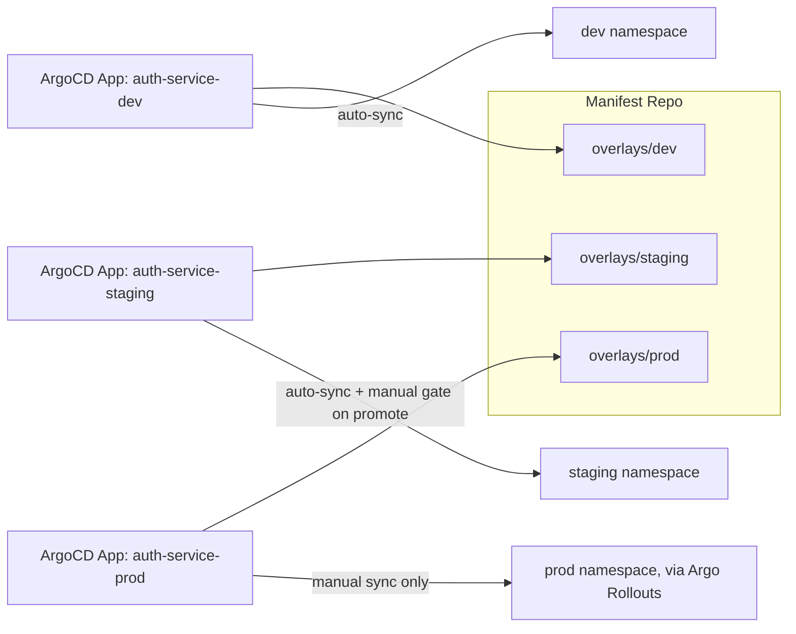
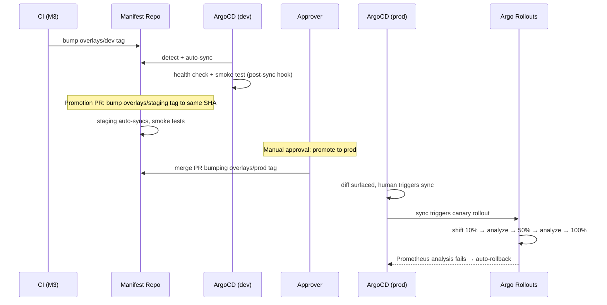

# M4 — GitOps Deployment Design Document

**Project:** Enterprise CI/CD Platform
**Milestone:** M4 (Documentation-only, no code)
**Depends on:** M0, M1, M2, M3 (all signed off)
**Status:** Draft for review

---

## 1. Objective

Design what happens from the moment CI (M3) bumps an image tag in the manifest
repo to Auth Service running, verified, and observable in the `dev` cluster —
and the promotion path from `dev` → `staging` → `prod`, including canary rollout
and automated rollback in production.

---

## 2. Manifest Repo Structure

```
manifests-repo/
├── base/
│   └── auth-service/
│       ├── deployment.yaml
│       ├── service.yaml
│       ├── configmap.yaml
│       └── kustomization.yaml
├── overlays/
│   ├── dev/auth-service/kustomization.yaml       # patches: replicas=1, image tag
│   ├── staging/auth-service/kustomization.yaml   # patches: replicas=2, image tag
│   └── prod/auth-service/
│       ├── kustomization.yaml                    # patches: replicas=3+, image tag
│       └── rollout.yaml                           # Argo Rollouts canary spec
└── argocd/
    └── applications/
        ├── auth-service-dev.yaml
        ├── auth-service-staging.yaml
        └── auth-service-prod.yaml
```

Kustomize base + overlays (not Helm) for this repo specifically: the manifest
repo's job is to hold *rendered, environment-specific* config that ArgoCD
reconciles directly — Helm's templating is more valuable one layer up, at chart
authoring time (where the service's Helm chart, not covered until services are
packaged, lives in `helm/charts/auth-service/` in the main repo and is what
*produces* these base manifests during the chart's own build, not at GitOps-sync
time). Keeping template logic out of the repo ArgoCD watches means "what's live"
is always literally what's in the file, no rendering step to debug during an
incident.

---

## 3. ArgoCD Application Model



| Environment | Sync policy | Rationale |
|---|---|---|
| dev | Automated sync, self-heal on | Fast feedback loop; drift auto-corrected |
| staging | Automated sync, self-heal on | Mirrors prod path for realistic pre-prod validation |
| prod | **Manual sync trigger** (automated detection, human-approved apply) | Ties to M0's manual approval gate — ArgoCD shows the diff, a human approves, then Rollouts takes over the mechanics |

**Why manual sync specifically in prod, not just an approval gate elsewhere:**
putting the gate at the sync trigger itself (not a separate CI approval step)
means the thing being approved is the actual Kubernetes diff ArgoCD is about to
apply — not an abstraction of it. What you approve is what ships.

---

## 4. Promotion Flow (dev → staging → prod)



Promotion between environments is itself a reviewed PR against the manifest
repo (bumping the overlay's tag to a SHA already proven in the prior
environment) — not a separate deployment tool. This keeps every promotion in the
same audit trail as every other change.

---

## 5. Canary Strategy (Production)

- **Argo Rollouts**, `canary` strategy, steps: 10% → pause + analysis → 50% →
  pause + analysis → 100%.
- **Analysis metrics** (from Prometheus, wired in M5): error rate (5xx ratio) and
  p99 latency of the canary pods specifically, compared against the stable
  pods' baseline over the same window — not just an absolute threshold, since
  absolute thresholds don't account for a bad day across the whole fleet.
- **Automatic rollback trigger:** analysis run fails its threshold →
  Rollouts aborts, shifts traffic back to `stable` fully, no human action
  required to stop the bleeding. A human is still paged, but the rollback
  itself doesn't wait on them.
- **Blue-green** is available as an alternate strategy for cases where instant
  full cutover (rather than gradual traffic shift) is preferred — documented as
  supported, but canary is the default for Auth Service given its request volume
  makes gradual analysis meaningful; a very low-traffic service might prefer
  blue-green since canary analysis needs enough traffic to be statistically
  meaningful.

---

## 6. Health Checks and Smoke Tests

| Check | When | What it verifies |
|---|---|---|
| Kubernetes readiness probe | Continuous | Pod can serve traffic (DB connection pool healthy, not just process running) |
| Kubernetes liveness probe | Continuous | Process hasn't deadlocked; separate from readiness so a slow dependency doesn't trigger a restart loop |
| Post-sync smoke test (ArgoCD `PostSync` hook) | After every sync in dev/staging | Calls `/v1/auth/register` + `/v1/auth/login` against a throwaway test account, confirms the full round trip works, not just that the process started |
| Canary analysis (Rollouts) | During prod rollout | Real production traffic's error rate/latency, not a synthetic check |

**Why readiness and liveness are deliberately different checks:** a liveness
probe restarting a pod that's merely waiting on a slow Postgres doesn't fix
anything and adds churn during exactly the incident where stability matters
most — readiness should fail (pull it from the Service's endpoints) while
liveness stays green (don't restart it) in that scenario.

---

## 7. Rollback Strategy

- **Automatic:** canary analysis failure (Section 5) — no human latency in the
  loop for the traffic-shift decision itself.
- **Manual:** `argocd app rollback` to a prior Git revision, or a `git revert` on
  the manifest repo — both produce the same result (ArgoCD reconciles to the
  reverted state), documented as equally valid; the runbook (later doc) will
  specify which to use based on whether ArgoCD is itself healthy at incident time.
- **What rollback does NOT cover:** database migrations. A rollback that reverts
  application code but leaves a forward-only DB migration applied is a known gap
  — Auth Service migrations (M2 data model) must be written backward-compatible
  for at least one version (expand/contract pattern), documented as a hard
  requirement for any migration PR, not left as an assumption.

---

## 8. Risks and Mitigations

| Risk | Impact | Mitigation |
|---|---|---|
| Canary analysis window too short to catch slow-burn regressions | Bad deploy reaches 100% before analysis catches it | Analysis duration tuned with real traffic data post-M7 implementation, not guessed; conservative (longer) default until proven safe to shorten |
| Manual prod sync forgotten/delayed after approval | Approved fix sits un-deployed during an incident | Alert/notification on pending prod sync older than a defined threshold (specified in runbook) |
| Manifest repo and app repo image tags drift out of sync (wrong tag promoted) | Wrong code version reaches an environment | Promotion PRs bump to a SHA copied directly from the prior environment's currently-synced tag, not typed manually |
| DB migration incompatible with rollback | Rollback "succeeds" but app breaks against reverted DB state | Expand/contract migration requirement (Section 7) enforced in M2 code review |

---

## 9. Acceptance Criteria for M4

- [ ] Manifest repo structure and Kustomize-not-Helm-at-this-layer decision (Section 2) agreed
- [ ] Per-environment sync policy, especially manual-sync-in-prod (Section 3) agreed
- [ ] Promotion-as-reviewed-PR flow (Section 4) agreed
- [ ] Canary strategy and analysis metrics (Section 5) agreed
- [ ] Readiness/liveness distinction (Section 6) agreed
- [ ] Rollback strategy and the DB migration caveat (Section 7) agreed

Only once signed off does actual Kustomize YAML, ArgoCD Application manifests,
and the Rollouts spec get written.

---

## 10. Open Decision

Next: M5 (Observability design) — the Prometheus metrics, Grafana dashboards,
and Loki/Jaeger wiring that Sections 5–6 above depend on.
