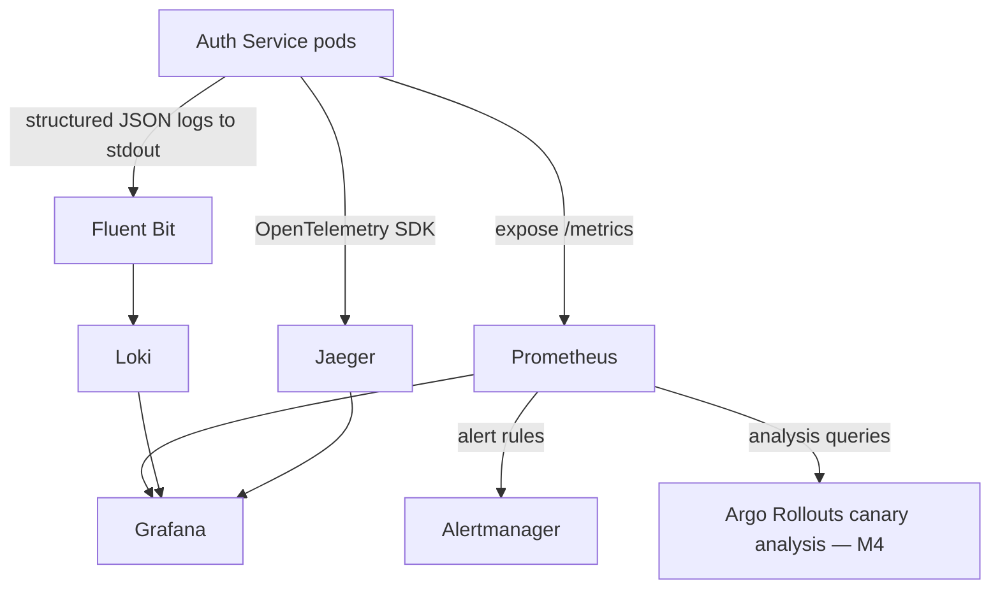

# M5 — Observability Design Document

**Project:** Enterprise CI/CD Platform
**Milestone:** M5 (Documentation-only, no code)
**Depends on:** M0–M4 (all signed off)
**Status:** Draft for review

---

## 1. Objective

Design the metrics, logging, and tracing needed to (a) run the canary analysis
M4 depends on, (b) give humans a real dashboard during an incident, and (c)
define SLIs/SLOs for Auth Service specifically — the first service to get this
treatment, replicated for others in M9.

---

## 2. The Three Pillars, Scoped to Auth Service

---

## 3. Metrics (Prometheus)

**Application-level (emitted by Auth Service via `promhttp` middleware):**

| Metric | Type | Labels | Used for |
|---|---|---|---|
| `http_requests_total` | Counter | `method`, `path`, `status` | Request rate, error rate (5xx/total) |
| `http_request_duration_seconds` | Histogram | `method`, `path` | Latency percentiles (p50/p95/p99) |
| `auth_login_attempts_total` | Counter | `result` (success/invalid_credentials/locked/rate_limited) | Security-relevant signal, brute-force detection |
| `auth_active_refresh_tokens` | Gauge | — | Session volume, capacity planning |
| `auth_token_verify_duration_seconds` | Histogram | — | Gateway-facing latency (this endpoint is called on nearly every request platform-wide, so it's tracked separately from general request latency) |

**Infrastructure-level (via existing exporters, not custom code):**
- Node metrics: `node-exporter` (CPU, memory, disk, network per node)
- Container metrics: cAdvisor (per-pod CPU/memory/network)
- Cluster metrics: `kube-state-metrics` (pod status, deployment status, HPA status)

**Why the canary-critical metrics are a strict subset:** `http_requests_total`
and `http_request_duration_seconds`, split by the `canary`/`stable` label Argo
Rollouts injects, are the two metrics the M4 canary analysis actually queries.
Everything else in this section is for dashboards/alerting, not the automated
rollback decision — keeping that distinction explicit avoids accidentally wiring
a noisy metric into an automated rollback trigger.

---

## 4. SLIs and SLOs (Auth Service, initial targets)

| SLI | SLO target | Rationale |
|---|---|---|
| Availability (non-5xx / total requests) | 99.9% over 30 days | Every downstream service depends on Auth Service being up; this is the platform's floor |
| Login latency (p99) | < 300ms | bcrypt cost factor (M2 §9) is the dominant cost here; this target is what that cost factor is benchmarked against |
| Token verify latency (p99) | < 50ms | Called on nearly every authenticated request platform-wide; a slow verify multiplies across every service |

These are **initial** targets, explicitly flagged as subject to revision once
real production traffic data exists — shipping a plausible-sounding SLO with no
data behind it yet is itself a documented limitation of this milestone, not
something to obscure.

---

## 5. Alerting

| Alert | Condition | Severity | Routes to |
|---|---|---|---|
| High error rate | 5xx ratio > 1% over 5 min | Page | On-call |
| Latency SLO burn | p99 login latency > 300ms sustained 10 min | Page | On-call |
| Login brute-force pattern | `auth_login_attempts_total{result="rate_limited"}` spikes | Ticket, not page | Security team review |
| Refresh token count anomaly | `auth_active_refresh_tokens` deviates >3 std dev from 7-day baseline | Ticket | Platform team |
| Pod crash loop | `kube_pod_container_status_restarts_total` rate increase | Page | On-call |

Alert-vs-ticket distinction is deliberate: not every anomaly should page someone
at 3am. Security-pattern alerts route to a review queue unless they cross a
severity threshold that indicates active exploitation, which would be a separate,
higher-severity rule layered on top later once real attack-pattern data exists.

---

## 6. Logging (Loki)

- Structured JSON logs only, per M2 §7 (Twelve-Factor: logs as event streams).
- Every log line carries: `request_id`, `trace_id` (correlates to Jaeger),
  `user_id` (when authenticated, for incident investigation), `level`.
- **Never logged:** password (plaintext or hash), full JWT/refresh token values
  (log a truncated/hashed reference instead), full request bodies on auth
  endpoints.
- Log level policy: `INFO` for request lifecycle events, `WARN` for handled
  errors (invalid credentials, rate limited), `ERROR` only for unexpected
  failures (DB unreachable, etc.) — `WARN`-level "failed login" volume is
  expected and shouldn't create alert fatigue if miscategorized as `ERROR`.

---

## 7. Tracing (Jaeger)

- OpenTelemetry SDK instruments: HTTP handler entry, Postgres queries, Redis
  calls, JWT signing — each as a child span under the request's root span.
- Trace ID generated at the Gateway (or at Auth Service if called directly in
  dev) and propagated via `traceparent` header — this is what lets an incident
  investigation follow one request across Gateway → Auth Service → Postgres.
- Sampling: 100% in dev/staging (low volume, want full visibility), head-based
  probabilistic sampling in prod (rate to be tuned once real traffic volume is
  known — documented as a tuning task, not a fixed guess).

---

## 8. Grafana Dashboard Spec

**Auth Service dashboard, panels:**
1. Request rate (by status code) — time series
2. Error rate (5xx %) — time series with SLO line overlay
3. Latency percentiles (p50/p95/p99) — time series, login and verify endpoints separate
4. Login attempts by result — stacked bar (success/invalid/locked/rate_limited)
5. Active refresh tokens — gauge/time series
6. Pod health (restarts, CPU, memory vs. limits) — from cAdvisor/kube-state-metrics
7. Deployment/rollout status — current canary step, analysis pass/fail history (from Rollouts' own metrics)
8. Recent errors — Loki panel, filtered to `level=error`, linked to trace IDs

This is the same dashboard referenced generically in the original brief's
"monitoring dashboard" requirement — built per-service (starting with Auth
Service) rather than as one generic dashboard, since the panels that matter
(login attempts, token counts) are service-specific, not generic infrastructure
panels reused across every service.

---

## 9. Risks and Mitigations

| Risk | Impact | Mitigation |
|---|---|---|
| SLO targets set without real traffic data turn out to be wrong | False confidence or alert fatigue from an unrealistic target | Explicitly flagged as provisional (Section 4); revisited after first real production month |
| Over-sampling traces in prod at high volume | Jaeger storage/cost blowout | Probabilistic sampling in prod, tuned post-launch (Section 7) |
| Sensitive data leaking into logs despite policy | Security/compliance exposure | Logging policy (Section 6) enforced via code review checklist; consider a log-scrubbing middleware as a defense-in-depth measure, added as a backlog item rather than blocking M5 sign-off |
| Canary analysis metric (Section 3) diverges from what's actually dashboarded | Confusing debugging experience — dashboard says one thing, rollback decision says another | Same underlying metrics (`http_requests_total`, `http_request_duration_seconds`) used for both, explicitly cross-referenced in this doc |

---

## 10. Acceptance Criteria for M5

- [ ] Metrics list, including the canary-critical subset (Section 3), agreed
- [ ] SLIs/SLOs (Section 4), with their provisional status acknowledged, agreed
- [ ] Alert list and page-vs-ticket routing (Section 5) agreed
- [ ] Logging policy, especially the never-log list (Section 6), agreed
- [ ] Tracing propagation and sampling approach (Section 7) agreed
- [ ] Dashboard panel spec (Section 8) agreed

Only once signed off does actual instrumentation code, Prometheus rules,
Grafana dashboard JSON, and Loki/Jaeger config get written.

---

## 11. Documentation Phase Complete

With M0–M5 signed off, every design decision needed to build Auth Service
end-to-end — architecture, infrastructure, the service itself, CI, deployment,
and observability — is on record before a single line of implementation code
exists. Implementation can now proceed against a coherent, cross-referenced set
of documents rather than improvised decisions made mid-build.

**Suggested implementation order** (each still gated by its own code review,
per the test plans already defined in M1–M5): Terraform modules → Auth Service
application code → CI workflow → Helm chart / Kustomize manifests / ArgoCD apps
→ instrumentation and dashboards. This mirrors dependency order: there's nowhere
to deploy the service until the infra exists, nothing to deploy until the
service exists, nothing to observe until it's deployed.
